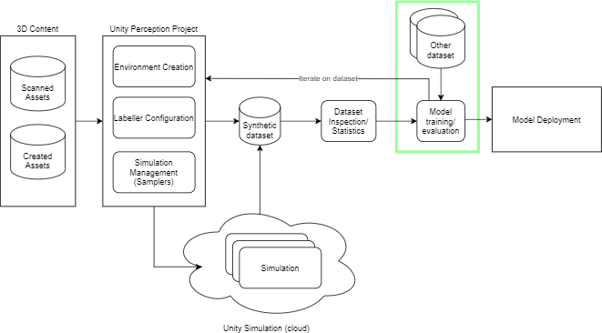
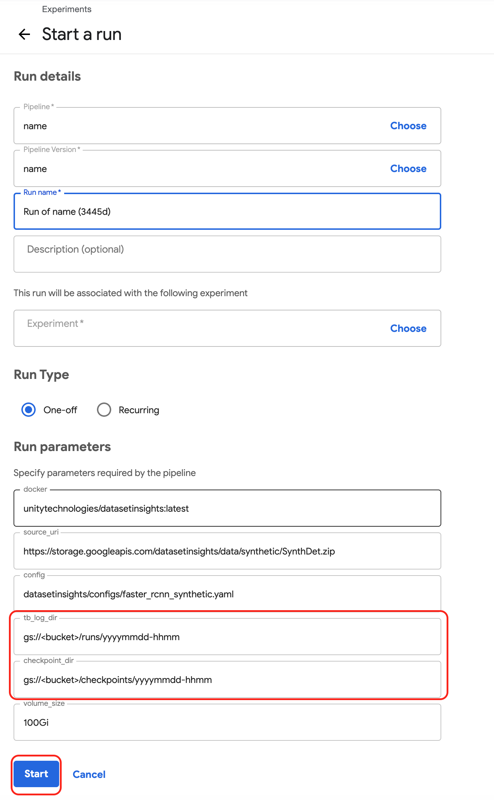
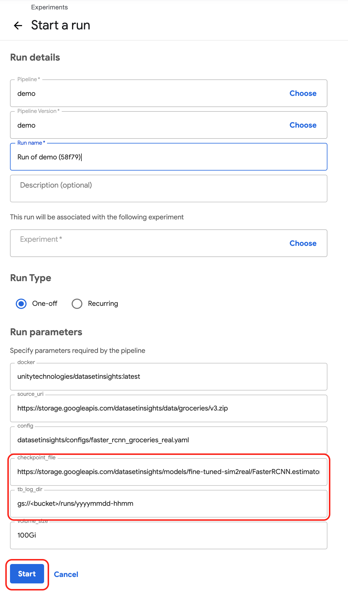
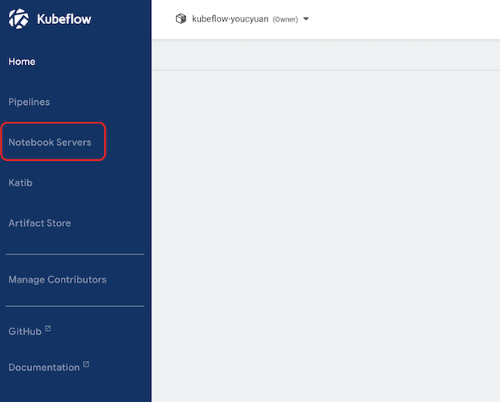
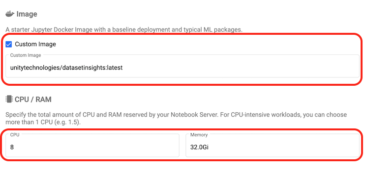
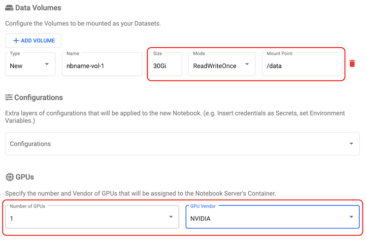
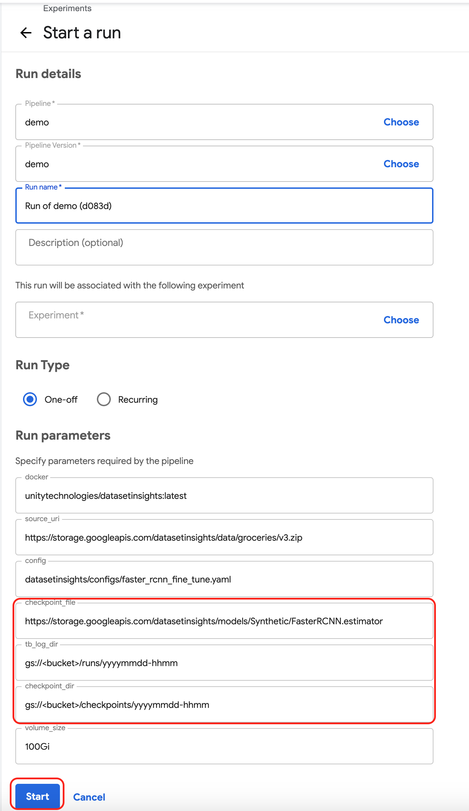

# Dataset Evaluation

This guide shows you how to use synthetic and real datasets to train [Faster-RCNN](https://arxiv.org/abs/1506.01497) object detection models and test the performance of those model on a well-known held out dataset of real images.

This guide focuses on training using `UnityGroceries-SyntheticSample` and validate using `UnityGroceries-Real`. Additional flows using other datasets are described [at the end of the guide](#other-training-methods).



These instructions focus on the recommended containerized approach to run a training job on a [Kubeflow](https://www.kubeflow.org/docs/gke/gcp-e2e) cluster on Google Kubernetes Engine ([GKE](https://cloud.google.com/kubernetes-engine)). We provide [pre-compiled Kubeflow pipelines](https://github.com/Unity-Technologies/datasetinsights/tree/master/kubeflow/compiled) and a [docker image](https://hub.docker.com/r/unitytechnologies/datasetinsights) for you to follow steps documented below. We do this to avoid reproducibility issues people may encounter on different platforms with different dependencies etc. We will assume you have access to a Kubeflow cluster going forward.

You can use our docker image on your own container-orchestration system by following similar steps.


## Part 1: Dataset Overview

### UnityGroceries-SyntheticSample dataset

We've made a small sample of 5k images generated using the [SynthDet](https://github.com/Unity-Technologies/SynthDet) Unity environment. To train a model on this dataset, you can skip directly to [part 2](#part-2-train-a-model) of this guide where you'll use a pre-compiled kubeflow pipeline that is already configured to fetch and then train on this sample dataset.

A larger dataset of 400k we used in our experiments can be made available [upon request](https://forms.gle/2BmZYQJmziq3ipK88). This dataset is not required to follow this tutorial.

### UnityGroceries-Real dataset

We've also made a new [dataset of 1.3k real images](https://github.com/Unity-Technologies/SynthDet/blob/master/docs/UnityGroceriesReal.md) which contain groceries and corresponding bounding boxes. You can look at it if you wish, or simply [skip ahead](#part-2-train-a-model) if you're interested in training a model on this dataset. The test split of this dataset will be used in [part 3](#part-3-evaluate-a-model).

### Create a new synthetic dataset using Unity Simulation (optional)

If you want to run the full end-to-end pipeline including synthetic dataset generation you can follow [this guide](https://github.com/Unity-Technologies/SynthDet/blob/master/docs/RunningSynthDetCloud.md) and then continue to run [this training pipeline](#train-on-synthetic-dataset-generated-on-unity-simulation).

## Part 2: Train a model on the UnityGroceries-SyntheticSample dataset

This section shows you how to train a model on UnityGroceries-SyntheticSample dataset. Note that this is a small dataset which is the fastest to train but won't produce the best results; for that, you can train a model that uses a larger synthetic dataset and [fine tunes the model on real images](#train-on-synthetic-and-real-world-dataset-optional). To observe the best results we have obtained, you can follow the instructions to run one of our [pre-trained models](#using-our-pre-trained-models) below.

To train the model, import [**this pre-compiled pipeline**](https://raw.githubusercontent.com/Unity-Technologies/datasetinsights/master/kubeflow/compiled/train_on_synthdet_sample.yaml) into your kubeflow cluster. The figure below shows how to do this using the [web UI](https://www.kubeflow.org/docs/pipelines/pipelines-quickstart/#deploy-kubeflow-and-open-the-pipelines-ui). You can optionally use the [KFP CLI Tool](https://www.kubeflow.org/docs/pipelines/sdk/sdk-overview/#kfp-cli-tool).


Once your pipeline has been imported, you can run it via the web UI as shown below. Alternatively, you can use the [KFP CLI Tool](https://www.kubeflow.org/docs/pipelines/sdk/sdk-overview/#kfp-cli-tool)


You have to specify run parameters required by this pipeline:

- `docker`: Path to a Docker Registry. We suggest changing this parameter to pull our images on Docker Hub with a specific tag, such as `unitytechnologies/datasetinsights:0.2.0`
- `source_uri`: The dataset source uri. You can use the default value which points to the required dataset for this pipeline.
- `config`: Estimator config YAML file. You can use the default value which points to a YAML file packaged with our docker images or you can load from remote locations GCS or any HTTP(s) using file prefix `gs://, http(s)://`.
- `tb_log_dir`: Path to store tensorboard logs used to visualize the training progress.
- `checkpoint_dir`: Path to store output estimator checkpoints. These checkpoints represent your trained model and will be used for evaluation.
- `volume_size`: Size of the Kubernetes Persistent Volume Claims (PVC) that will be used to store the dataset. You can use the default value.

Set `tb_log_dir` and `checkpoint_dir` to a location that is convenient for you and your Kubernetes cluster has permissions to write to. This is typically a GCS path under the same GCP project. You want to keep a note on these directories that will be used for tensorboard visualization and model evaluation. Note that an invalid location will cause the job to fail, whereas a path to the local filesystem may run but will be hard to monitor as you won't have easy access to the files.


Next you can jump to [part 3](#part-3-monitor-training-in-tensorboard) to monitor the training in tensorboard. You'll need the locations of your logs and checkpoints in the next steps.

## Part 3: Monitor training in tensorboard
While the model is training on kubeflow, tensorboard can be used to visualize the training process. To open tensorboard, run the following command:

```bash
docker run \
  -p 6006:6006 \
  -e GOOGLE_APPLICATION_CREDENTIALS=/tmp/key.json \
  -v $GOOGLE_APPLICATION_CREDENTIALS:/tmp/key.json:ro \
  -t tensorflow/tensorflow \
  tensorboard \
  --host=0.0.0.0 \
  --logdir=gs://<tb_log_dir>
```
This command assumes you have an environment variable `GOOGLE_APPLICATION_CREDENTIALS` in the host machine that points to a GCP service account credential file. This service account should have permissions to read `tb_log_dir` to download tensorboard files. If you don't have a GCP service account credential file, you should follow [these instructions](https://cloud.google.com/docs/authentication/production#providing_credentials_to_your_application) to generate a valid credential file.

Then, open `http://localhost:6006` in web browser to see tensorboard results.

## Part 4: Evaluate a model

In [part 2](#part-2-train-a-model), you trained a model using one of our pre-compiled pipeline. In this section, you will use a trained model from part 2 to generate predictions on the test split of UnityGroceries-Real dataset and measure its performance using well-known object detection metrics like [mAP](https://datasetinsights.readthedocs.io/en/latest/datasetinsights.evaluation_metrics.html#datasetinsights.evaluation_metrics.average_precision_2d.MeanAveragePrecisionAverageOverIOU) and [mAR](https://datasetinsights.readthedocs.io/en/latest/datasetinsights.evaluation_metrics.html#datasetinsights.evaluation_metrics.average_recall_2d.MeanAverageRecallAverageOverIOU).

We have prepared another Kubeflow [pipeline](https://raw.githubusercontent.com/Unity-Technologies/datasetinsights/master/kubeflow/compiled/evaluate_the_model.yaml) for this. You can import [**this pre-compiled pipeline**](https://raw.githubusercontent.com/Unity-Technologies/datasetinsights/master/kubeflow/compiled/evaluate_the_model.yaml) into your kubeflow cluster. Once your pipeline has been imported, you can run it via the web UI as shown below. Alternatively, you can use the [KFP CLI Tool](https://www.kubeflow.org/docs/pipelines/sdk/sdk-overview/#kfp-cli-tool)



Whether you trained a model on synthetic, real or multiple datasets, you'll need to specify a model stored in the `checkpoint_dir` from previous pipelines. You can choose any checkpoint files such as `<checkpoint_dir>/FasterRCNN.ep1.estimator`, or you want to pick the checkpoint that give you the best validation result in the previous training process.

You have to specify run parameters required by this pipeline:

- `docker`: Path to a Docker Registry. We suggest changing this parameter to pull our images on Docker Hub with a specific tag, such as `unitytechnologies/datasetinsights:0.2.0`
- `source_uri`: The dataset source uri. You can use the default value which points to the required dataset for this pipeline.
- `config`: Estimator config YAML file. You can use the default value which points to a YAML file packaged with our docker images or you can load from remote locations GCS or any HTTP(s) using file prefix `gs://, http(s)://`.
- `checkpoint_file`: Path to the Estimator checkpoint file from previous training runs that you want to load for evaluation. (e.g. <checkpoint_dir>/FasterRCNN.estimator)
- `tb_log_dir`: Path to store tensorboard logs used to visualize the evaluation progress.
- `volume_size`: Size of the Kubernetes Persistent Volume Claims (PVC) that will be used to store the dataset. You can use the default value.

Just like the training pipeline, you'll want to change `tb_log_dir` to point to a location that is convenient for you and you have permission to write to. This is where you'll read the logs and see the **performance metrics** once the pipeline completes.


In addition to the logs, the performance metrics are also available in a Jupyter Notebook we have prepared that includes code to visualize the predictions.

### Visualizing predictions and performance

We recommend running our [docker image](https://hub.docker.com/r/unitytechnologies/datasetinsights) which includes Jupyter as well as our notebooks if you don't want to setup the environment on your own. We also recommend using [Kubeflow Notebooks](https://www.kubeflow.org/docs/notebooks/setup/) with GPU support to speed up model inference.





You should specify the following parameters:

- Choose **Custom image** and specify value: `unitytechnologies/datasetinsights:0.2.0`
- Change CPU and Memory. We recommend using `8` CPU with `32.0Gi` Memory
- Change the **Mount Point** under **Data Volumes** section to `/data`. Make sure you have more than `30GiB` storage.
- Select `1` GPU with **Vendor** `NVIDIA`

Once the notebook server starts successfully, open the server and choose `SynthDet_Evaluation.ipynb` under `/datasetinsights/notebooks` directory. Follow the instructions in the notebook to visualize predictions and performance.

Alternatively, you can follow similar [instructions](RunningSynthDetCloud.md#step-6-run-dataset-statistics-using-the-datasetinsights-jupyter-notebook) to run notebooks on local host machine. Replace the first step with the following command:

```bash
docker run \
  -p 8888:8888 \
  -e GOOGLE_APPLICATION_CREDENTIALS=/tmp/key.json \
  -v $GOOGLE_APPLICATION_CREDENTIALS:/tmp/key.json:ro \
  -v $HOME/data:/data \
  -t unitytechnologies/datasetinsights:0.2.0
```

## Other training methods
The following sections describe how to train using synthetic data generated on Unity Simulation, fine-tune on UnityGroceries-Real, and train from scratch on the UnityGroceries-Real dataset.

### Fine-tune synthetic model on a real-world dataset

To further improve model performance, you may also fine-tune your model on the UnityGroceries-Real dataset. We found that this approach of training first on synthetic and then fine-tuning on real produces the best results. The best results we have obtained are trained on a set of 400k synthetic images generated in Unity Simulation. To observe these results, you can follow the instructions to run one of our [pre-trained models](#using-our-pre-trained-models) below.

To train the model, import [**this pre-compiled pipeline**](https://raw.githubusercontent.com/Unity-Technologies/datasetinsights/master/kubeflow/compiled/train_on_synthetic_and_real_dataset.yaml) into your kubeflow cluster. The figure below shows how to do this using the [web UI](https://www.kubeflow.org/docs/pipelines/pipelines-quickstart/#deploy-kubeflow-and-open-the-pipelines-ui). You can optionally use the [KFP CLI Tool](https://www.kubeflow.org/docs/pipelines/sdk/sdk-overview/#kfp-cli-tool).


Once your pipeline has been imported, you can run it via the web UI as shown below. Alternatively, you can use the [KFP CLI Tool](https://www.kubeflow.org/docs/pipelines/sdk/sdk-overview/#kfp-cli-tool)



You have to specify run parameters required by this pipeline:

- `docker`: Path to a Docker Registry. We suggest changing this parameter to pull our images on Docker Hub with a specific tag, such as `unitytechnologies/datasetinsights:0.2.0`
- `source_uri`: The dataset source uri. You can use the default value which points to the required dataset for this pipeline.
- `config`: Estimator config YAML file. You can use the default value which points to a YAML file packaged with our docker images or you can load from remote locations GCS or any HTTP(s) using file prefix `gs://, http(s)://`.
- `checkpoint_file`: Path to the Estimator checkpoint file from previous training runs that you want to load and resume training.
- `tb_log_dir`: Path to store tensorboard logs used to visualize the training progress.
- `checkpoint_dir`: Path to store output Estimator checkpoints. You can use one of the checkpoints for estimator evaluation.
- `volume_size`: Size of the Kubernetes Persistent Volume Claims (PVC) that will be used to store the dataset. You can use the default value.

Set `tb_log_dir` and `checkpoint_dir` to a location that is convenient for you and your Kubernetes cluster has permissions to write to. This is typically a GCS path under the same GCP project. You want to keep a note on these directories that will be used for tensorboard visualization and model evaluation. Note that an invalid location will cause the job to fail, whereas a path to the local filesystem may run but will be hard to monitor as you won't have easy access to the files.

Set `checkpoint_file` to point to an estimator trained in a previous training run on synthetic data. This pipeline will load this model and resume training using real world dataset. You may also use [one of our pre-trained models](#using-our-pre-trained-models) as the starting checkpoint file.


Next you can jump back to [part 3](#part-3-monitor-training-in-tensorboard) to monitor the training in tensorboard and continue on to model evaluation.

### Train on UnityGroceries-Real dataset

This section shows you how to train a model on the UnityGroceries-Real dataset. Note that this won't produce the best results; for that, you can train a model that uses a larger synthetic dataset and [fine tunes the model on real images](#train-on-synthetic-and-real-world-dataset-optional). To observe the best results we have obtained, you can follow the instructions to run one of our [pre-trained models](#using-our-pre-trained-models) below.

To train the model, simply import [**this pre-compiled pipeline**](https://raw.githubusercontent.com/Unity-Technologies/datasetinsights/master/kubeflow/compiled/train_on_real_world_dataset.yaml) into your kubeflow cluster. The figure below shows how to do this using the [web UI](https://www.kubeflow.org/docs/pipelines/pipelines-quickstart/#deploy-kubeflow-and-open-the-pipelines-ui). You can optionally use the [KFP CLI Tool](https://www.kubeflow.org/docs/pipelines/sdk/sdk-overview/#kfp-cli-tool).


Once your pipeline has been imported, you can run it via the web UI as shown below. Alternatively, you can use the [KFP CLI Tool](https://www.kubeflow.org/docs/pipelines/sdk/sdk-overview/#kfp-cli-tool)


You have to specify run parameters required by this pipeline:

- `docker`: Path to a Docker Registry. We suggest changing this parameter to pull our images on Docker Hub with a specific tag, such as `unitytechnologies/datasetinsights:0.2.0`
- `source_uri`: The dataset source uri. You can use the default value which points to the required dataset for this pipeline.
- `config`: Estimator config YAML file. You can use the default value which points to a YAML file packaged with our docker images or you can load from remote locations GCS or any HTTP(s) using file prefix `gs://, http(s)://`.
- `tb_log_dir`: Path to store tensorboard logs used to visualize the training progress.
- `checkpoint_dir`: Path to store output Estimator checkpoints. You can use one of the checkpoints for estimator evaluation.
- `volume_size`: Size of the Kubernetes Persistent Volume Claims (PVC) that will be used to store the dataset. You can use the default value.

Set `tb_log_dir` and `checkpoint_dir` to a location that is convenient for you and your Kubernetes cluster has permissions to write to. This is typically a GCS path under the same GCP project. You want to keep a note on these directories that will be used for tensorboard visualization and model evaluation. Note that an invalid location will cause the job to fail, whereas a path to the local filesystem may run but will be hard to monitor as you won't have easy access to the files.


Next you can jump to [part 3](#part-3-monitor-training-in-tensorboard) to monitor the training in tensorboard. You'll need the locations of your logs and checkpoints in the next steps.

### Train on synthetic dataset generated on Unity Simulation

This section shows you how to train a model on your own dataset generated by running the [SynthDet] environment on [Unity Simulation](https://unity.com/products/unity-simulation). You can follow [these instructions](https://github.com/Unity-Technologies/SynthDet/blob/master/docs/RunningSynthDetCloud.md) to generate the dataset.

To train the model, simply import [**this pre-compiled pipeline**](https://raw.githubusercontent.com/Unity-Technologies/datasetinsights/master/kubeflow/compiled/train_on_synthetic_dataset_unity_simulation.yaml) into your kubeflow cluster. The figure below shows how to do this using the [web UI](https://www.kubeflow.org/docs/pipelines/pipelines-quickstart/#deploy-kubeflow-and-open-the-pipelines-ui). You can optionally use the [KFP CLI Tool](https://www.kubeflow.org/docs/pipelines/sdk/sdk-overview/#kfp-cli-tool).


Once your pipeline has been imported, you can run it via the web UI as shown below. Alternatively, you can use the [KFP CLI Tool](https://www.kubeflow.org/docs/pipelines/sdk/sdk-overview/#kfp-cli-tool)


You have to specify run parameters required by this pipeline:

- `docker`: Path to a Docker Registry. We suggest changing this parameter to pull our images on Docker Hub with a specific tag, such as `unitytechnologies/datasetinsights:0.2.0`
- `project_id`: A Unity [project ID](https://docs.unity3d.com/Manual/SettingUpProjectServices.html). Example format: xxxxxxxx-xxxx-xxxx-xxxx-xxxxxxxxxxxx.
- `run_execution_id`: A 7-character Run Definition ID used by Unity Simulation. See Unity Simulation [documentation](https://github.com/Unity-Technologies/Unity-Simulation-Docs/blob/master/doc/cli.md#argument-descriptions).
- `access_token`: Unity Simulation access token. You can run `usim inspect auth` to print out the access token. Please see the official Unity Simulation [doc](https://github.com/Unity-Technologies/Unity-Simulation-Docs/blob/master/doc/cli.md#usim-inspect-auth) to obtain a valid access token.
- `config`: Estimator config YAML file. You can use the default value which points to a YAML file packaged with our docker images or you can load from remote locations GCS or any HTTP(s) using file prefix `gs://, http(s)://`.
- `tb_log_dir`: Path to store tensorboard logs used to visualize the training progress.
- `checkpoint_dir`: Path to store output Estimator checkpoints. You can use one of the checkpoints for estimator evaluation.
- `volume_size`: Size of the Kubernetes Persistent Volume Claims (PVC) that will be used to store the dataset. You should change this value according to the dataset that was generated. If you use default settings from [these instructions](https://github.com/Unity-Technologies/SynthDet/blob/master/docs/RunningSynthDetCloud.md), you should expect `1.2TiB` storage required for 400k images.

Set `tb_log_dir` and `checkpoint_dir` to a location that is convenient for you and your Kubernetes cluster has permissions to write to. This is typically a GCS path under the same GCP project. You want to keep a note on these directories that will be used for tensorboard visualization and model evaluation. Note that an invalid location will cause the job to fail, whereas a path to the local filesystem may run but will be hard to monitor as you won't have easy access to the files.


## Using our pre-trained models

We trained a model using `~400k` synthetic examples and then fine-tuned it using `~700` real images. You can use the same [visual inspection notebook](https://github.com/Unity-Technologies/datasetinsights/blob/master/notebooks/SynthDet_Evaluation.ipynb) mentioned above, but use one of our models from the list below:

- [Real World (760)](https://storage.googleapis.com/datasetinsights/models/Real-World/FasterRCNN.estimator)
- [Synthetic (400,000)](https://storage.googleapis.com/datasetinsights/models/Synthetic/FasterRCNN.estimator)
- [Synthetic (400,000) + Real World (76)](https://storage.googleapis.com/datasetinsights/models/Synthetic-And-Real-World-76-images/FasterRCNN.estimator)
- [Synthetic (400,000) + Real World (380)](https://storage.googleapis.com/datasetinsights/models/Synthetic-And-Real-World-380-images/FasterRCNN.estimator)
- [Synthetic (400,000) + Real World (760)](https://storage.googleapis.com/datasetinsights/models/Synthetic-And-Real-World-760-images/FasterRCNN.estimator)
