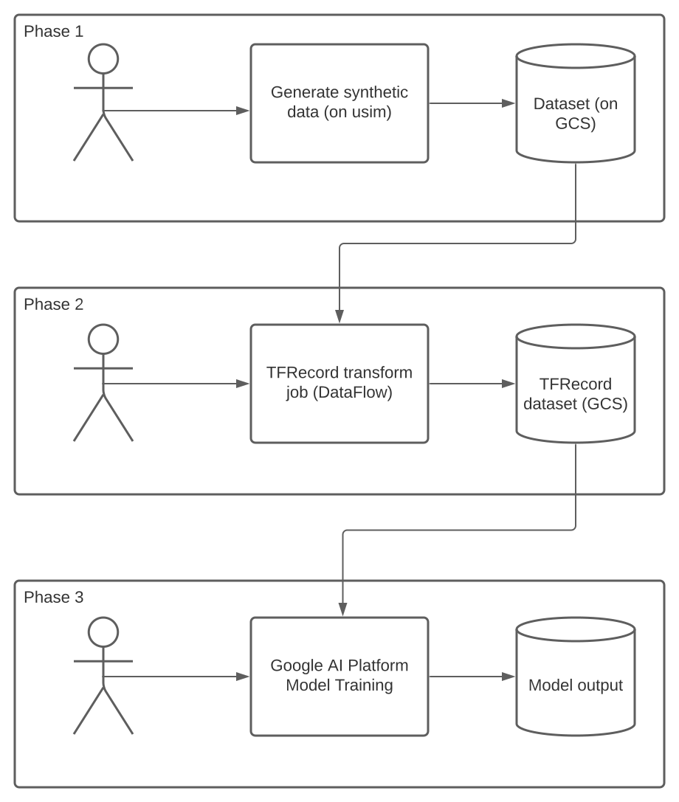
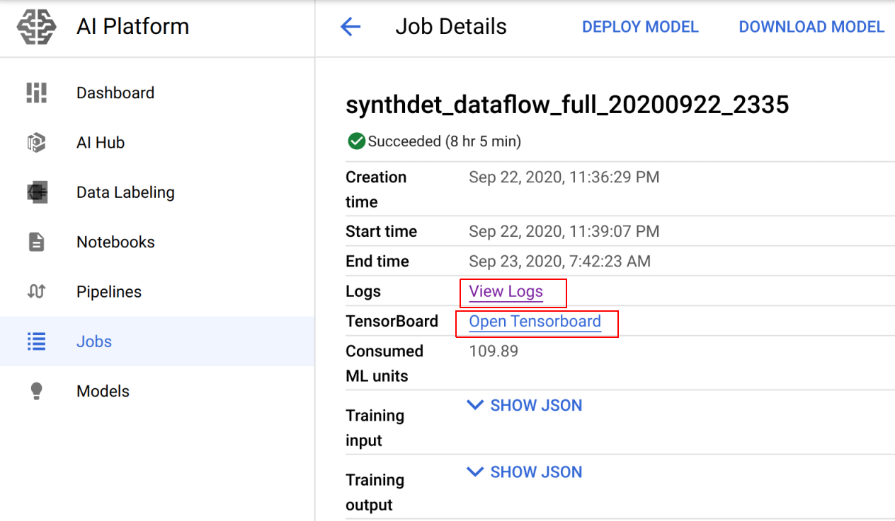
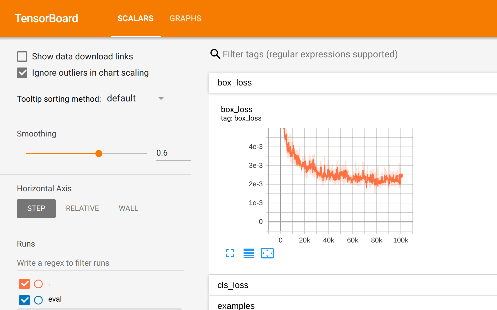

# Object Detection Model Training With Google AI Platform

## When should you opt for this model training method?

This model training method is applicable if you generated your data from Unity Simulation, want to use Tensorflow and you are either already using GCP or don't mind signing up. **Please note that this will incur charges for using GCP.**

The workflow here will take place in 3 phases.

* [Phase 1](#phase-1-get-synthetic-data-into-your-gcp-project) is where we'll transfer the data from Unity Simulation to our own GCP project's storage bucket.
* In [Phase 2](#phase-2-transform-data-to-tensorflow-format), we'll take this data and transform it into tfrecord format using GCP's DataFlow service. We do this in order to be able to use a built-in model training algorithm on Google AI Platform.
* Finally, in [Phase 3](#phase-3-use-google-ai-platform-to-train-an-object-detection-model), we'll submit a model training job to Google AI Platform for the data we transformed in phase 2.

Here is a visual representation of the steps we just outlined:



## Prerequisites

* Clone this repo locally and navigate to the `tf-dataflow` directory.
* A Google Cloud Platform (GCP) account and project
   * Download `gcloud` tool locally - [docs](https://cloud.google.com/sdk/gcloud#downloading_the_gcloud_command-line_tool). This includes both `gcloud` and `gsutil`, which we'll be using throughout this tutorial.
* A dataset generated on Unity Simulation - you can find out more in the [SynthDet documentation](https://github.com/Unity-Technologies/SynthDet/blob/master/docs/RunningSynthDetCloud.md).
* Unity Simulation CLI - download and usage instructions [here](https://github.com/Unity-Technologies/com.unity.perception/blob/master/com.unity.perception/Documentation%7E/Tutorial/Phase3.md#step-3). Please carefully read this section!
* DataFlow must be enabled for your project. More instructions can be found on Google's [official DataFlow documentation](https://cloud.google.com/dataflow/docs/quickstarts/quickstart-python). If you're an owner of the GCP project, you'll only need to follow the guide up to Step 3 of the "Before you begin" section.
* AI Platform must enabled for your GCP Project. [Official guide here](https://cloud.google.com/ai-platform/training/docs/algorithms/object-detection-start). Please ensure you've done everything up to the "Setup" section of that guide.

## Getting started

### Phase 1: Get synthetic data into your GCP project

Please use a bucket in your project that's only for this purpose! Assuming you generated data already, you'll need to transfer it to your own bucket. For that, you need to grant our service accounts permissions.

| Account | Role/Permission |
|---|---|
| `project-787244313480@storage-transfer-service.iam.gserviceaccount.com`  | Role: `Storage Legacy Bucket Writer` |
| `bhram-prd-usc1-datatransfer@unity-ai-bhram-prd.iam.gserviceaccount.com` | Role: `Storage Legacy Bucket Reader`  |

The first service account is an internal one used by Google Storage Transfer service to perform transfer operations, thus `Storage Legacy Bucket Writer` required. The second service account is for Unity Simulation service to validate destination bucket. While we've chosen a fairly restrictive role already, note that it has more permissions that what is absolutely required, which is `storage.bucket.get`. You can create your own role with just that permission (see Optional section below).

**Optional:** If you'd like to create your own more restrictive role, you can do the following.
```bash
$ gcloud iam roles create <role-id> --project=<project id> --file=sample-role.yaml
Created role [<role-id>].
description: Grants storage.buckets.read to holders.
etag: BwWxRJRMOVU=
includedPermissions:
- storage.buckets.get
name: projects/<gcp project>/roles/<role-id>
stage: GA
title: GetStorageBucketRole

$ gsutil iam ch serviceAccount:bhram-prd-usc1-datatransfer@unity-ai-bhram-prd.iam.gserviceaccount.com:projects/<gcp project>/roles/<role-id> gs://<your bucket>
```

Once the permissions are set up, we can proceed with the data transfer.

1. Grab the token from your Unity Simulation configuration.

   If you have `jq`, you can use approach (a). Otherwise, use `usim inspect auth` (b) to have usim print out your access token and store that in a variable in the shell (`export token=<token>`).

   a.
   ```bash
    # Grab the token used to communicate with Unity
    token=$(cat ~/.usim/token.json | jq .access_token -r)
   ```
   b.
   ```bash
   $ usim inspect auth
   Protect your credentials. They may be used to impersonate your requests.
   access token: Bearer a948904f2f0f479b8f8197694b30184b0d2ed1c1cd2a1ec0fb85d299a192a447 # <-- THIS
   expires in: -2 days, 1:25:00.810827
   expired: True
   refresh token: 07bafbe63a0e7c57c572aedf1c228022b537e28785013d7be017fc78731a8cc5
   updated: 2020-10-06 16:32:32.110689
   ```
2. Call the Unity Simulation API to initiate the data transfer. You will need your Unity Project ID for this step (`cat ~/.usim/project_id.txt` for the active project ID in Unity Simulation). Additionally, you'll need the `definition-id` and `execution-id`. You can get these buy executing `usim get runs` and grab the ids corresponding to your run - more info and examples [here](https://github.com/Unity-Technologies/com.unity.perception/blob/master/com.unity.perception/Documentation%7E/Tutorial/Phase3.md#step-3). We're now ready to initiate the data transfer.
   ```bash
   # Initiate the data transfer to your own bucket - pay attention to the response, which will be used in step 3
   curl -X PUT 'https://api.simulation.unity3d.com/v1/projects/<your Unity project id>/data_transfer' \
       -H "Content-Type: application/json" \
       -H "Authorization: Bearer $token" \
       --data-raw '{
           "destination_bucket": "your-bucket-name",
           "run_definition_id": "your-run-definition-id",
           "run_execution_id": "your-run-execution-id"
       }'
   ```
3. Wait for the data transfer to complete. You can keep track of the status of your transfer job using this command:
   ```bash
   curl -X GET "https://api.simulation.unity3d.com/v1/projects/<your Unity project id>/data_transfer/<data transfer id>" -H "Authorization: Bearer $token"
   ```
   You transfer job has status `running` when job is in progress, and `success` or `failed` when job is finished. The time it takes to finish a transfer job varies due to your data size, GCP status and resource contention.

The Unity Simulation API docs can be found [here](https://api.simulation.unity3d.com/swagger/index.html).

### Phase 2: Transform Data to TensorFlow format


#### Local run (Optional)
Before kicking off a job in DataFlow, let's try this out locally to make sure it looks OK! In order to do that, we assume a few things about the directory structure where you'll be running this. All subsequent commands are assumed to run under `tf-dataflow` directory. Example output from running `find` should be the following:
```bash
$ find . -name "*.py" -o -name "*.sh"
./dataflow-run.sh
./tfproc/__init__.py
./tfproc/tfproc.py
./setup.py
./main.py
```
Note that we'll be running this local experiment with just 1 app-param. Your real run may have generated much more data.

1. Set up a Python virtual environment. We're assuming you're on Python3 (less than Python3.8).
   ```bash
   python3 -m venv .venv
   source .venv/bin/activate
   pip install -r requirements.txt

   ```
   If you have issues setting up an environment locally, we also provide a Dockerfile that should provide a more stable environment.
   ```bash
   docker build . -t tfdataflow
   # wait for container to finish building...
   ```
   **Windows**
   ```powershell
   docker run --rm -it -v "$env:appdata/gcloud\:/root/.config/gcloud" tfdataflow
   ```
   **Linux/OSX**
   ```bash
   docker run --rm -it -v ~/.config/gcloud:/root/.config/gcloud tfdataflow
   ```
   Now you should be able to execute the rest of the steps as before. **Note** that in order to do the local run, you will need to mount a volume containing that data inside the container.
2. Make a run executions directory manually and copy the single app param into it. An app param corresponds to a configuration that your USim execution ran with. Here's an example:
   ```bash
   mkdir urn:run_executions:5M6wq80 # <-- customize the id to whatever yours looks like. This example uses "5M6wq80"
   cd urn:run_executions:5M6wq80
   ```
   Then navigate to a specific app-param directory in GCS and copy this path for your destination bucket as shown below:
   
   Then run...
   ```bash
   # Let's make sure we have read access to the GCS objects we need
   $ gsutil ls "gs://84c6f824-c4ee-4ef2-b654-1030f519e0e9/projects/rut-test/run_executions/urn:run_definitions:El64GVP/urn:run_executions:5M6wq80" | head -5
   gs://84c6f824-c4ee-4ef2-b654-1030f519e0e9/projects/rut-test/run_executions/urn:run_definitions:El64GVP/urn:run_executions:5M6wq80/urn:app_params:20VD689/
   # ^ that was OK. Now we'll copy that data over
   gsutil -m cp -r <paste your path from step 2 here> .
   cd ..
   ```
3. Go back up to where the `dataflow-run.sh` script is stored and run the following. Note that the path (`-p` arg) must be to a directory that contains subdirectories for each `app_param`. In our case, there will only be one.
   ```bash
   ./dataflow-run.sh -e local -p urn:run_executions:<your-execution-id> -g <your google project id>
   ```

   This will produce training and evaluation data in tfrecord format inside of the directory where we copied the app_param. If that looks OK, we can proceed to the next step. If you want to visualize the data, you can use the [tfrecord-viewer](https://github.com/sulc/tfrecord-viewer) project.
   ```bash
   $ cd "urn:run_executions:<your-execution-id>"
   # Example
   $ find output -type f
     output/train/72d5852978c4e4ff4c7108946062ae5da8bf4548.tfrecord
     output/eval/72d5852978c4e4ff4c7108946062ae5da8bf4548.tfrecord
   ```
   Note that the `dataflow-run.sh` script is a convenience with some default parameters. You can also run the python script directly. Here's an example:
   ```bash
   python main.py --setup_file=./setup.py \
         --source ${path} \
         --eval-pct 20 \
         --runner DataflowRunner \
         --project ${project} \
         --region ${region} \
         --temp_location ${path}/tmp \
         --staging_location  ${path}/stg \
         --num_workers ${NUM_WORKERS} \
         --max_num_workers ${MAX_NUM_WORKERS} \
         --autoscaling_algorithm THROUGHPUT_BASED
   ```

#### Real run
We'll use the same project that we had in step 1 of our local run. With that, let's run:
```bash
./dataflow-run.sh -e real -p "gs://projects/<unity project id - GUID>/run_executions/urn:run_definitions:<alnum string>/urn:run_executions:<alnum string>" -g <your google project id>
```

This will bundle the DataFlow job and run it on GCP. This job assumes that it can parallelize on app-params to increase throughput. **Performance will be poor if all of your data is in a single app param**. Once it's complete, you should be able to move onto the next step of training the actual model. When you run the above command, a bunch of things will be printed to console and it'll continue tailing on your terminal. However, you can cancel out of this at any time and it'll continue running on GCP.

#### (Optional) Convert real world data to Tensorflow format

In case real world data exists and needed to be convert as well:

- Real world data in similar format as Unity Simulation synthetic data format

  If your real-world date is in the **exact same** format as Unity Simulation synthetic data format, you can simply follow **Phase 2** steps to transform the data locally and then upload to GCS for further utilization.

  If you happen to have access to real-world date for SynthDet ([UnityGroceries-Real](https://github.com/Unity-Technologies/SynthDet/blob/master/docs/UnityGroceriesReal.md)), you need to be careful because there are minor differences in format. You can modify this [Python script](real_data_loader.py), run it locally for data transformation and then upload to GCS for further utilization.
  ```python
  _data_base_path = os.path.join('/home', 'your-base-path')
  _run_id = "real_data_input_folder"
  _data_path = os.path.join(_data_base_path, _run_id)
  _out_path = os.path.join(_data_base_path, 'real_data_tfrecord_output')
  ```
  Note that you need to make sure `annotations.json` presents in `_data_path`.
  ```bash
  python3.7 real_data_loader.py
  cd <your-output-path>
  gsutil -m rsync -r . gs://your-bucket
  ```

- Real world data in some other common formats:

  Use these [scripts](https://github.com/tensorflow/models/tree/master/research/object_detection/dataset_tools) provided by Google to convert your data.

### Phase 3: Use Google AI Platform to train an object detection model

In this section, we will provide example configuration and commands to train a built-in object detection model on Google AI Platform. To view the official document for Google AI Platform, click [HERE](https://cloud.google.com/ai-platform/training/docs/algorithms/object-detection).

#### *Submit a training job*

Training job can be submitted either through GCP Console UI or Google Cloud SDK (`gcloud`). Using `gcloud` command is recommended because one can easily iterate on it without re-entering all parameters over and over again. To install and initialize `gcloud` on your working environment, follow the link and instructions in above **prerequisites** section. Make sure you login and set target GCP project:

```bash
gcloud auth login
gcloud config set project PROJECT_ID
```

If you choose to use `gcloud`, here is an example:

1. First, you need to create `config.yaml` on your local working directory to define compute resources for your model training.
   ```yaml
   trainingInput:
     scaleTier: CUSTOM
     masterType: n1-standard-16
     masterConfig:
       imageUri: gcr.io/cloud-ml-algos/image_object_detection:latest
       acceleratorConfig:
         type: NVIDIA_TESLA_P100
         count: 1
     workerType:  cloud_tpu
     workerConfig:
       imageUri: gcr.io/cloud-ml-algos/image_object_detection:latest
       acceleratorConfig:
         type: TPU_V2
         count: 8
     workerCount: 1
   ```

   Find out more about supported compute resources [here](https://cloud.google.com/ai-platform/training/docs/machine-types#machine_type_table)

2. Make sure your `gcloud` is configured to target GCP project, and then use `gcloud` command to submit a training job as the example below.

   A lot of parameters are exposed by Google AI Platform for built-in object detection model training.
   A full list parameter references can be found [here](https://cloud.google.com/ai-platform/training/docs/algorithms/object-detection-start#submit_a_training_job)

    ```bash
    gcloud ai-platform jobs submit training "synthdet_full_yyyymmdd_HHMM" \
      --region="us-central1" \
      --config=config.yaml \
      --job-dir="gs://<bucket-name>/projects/<project-GUID>/run_executions/urn:run_definitions:<alnum-string>/urn:run_executions:<alnum-string>/model" \
      -- \
      --training_data_path="gs://<bucket-name>/projects/<project-GUID>/run_executions/urn:run_definitions:<alnum-string>/urn:run_executions:<alnum-string>/output/train/*.tfrecord" \
      --validation_data_path="gs://<bucket-name>/projects/<project-GUID>/run_executions/urn:run_definitions:<alnum-string>/urn:run_executions:<alnum-string>/output/eval/*.tfrecord" \
      --train_batch_size=16 \
      --num_eval_images=200 \
      --train_steps_per_eval=2000 \
      --max_steps=75000 \
      --num_classes=63 \
      --warmup_learning_rate=0.01 \
      --warmup_steps=500 \
      --initial_learning_rate=0.001 \
      --image_size="960,1280" \
      --fpn_type="nasfpn" \
      --aug_scale_min=0.8 \
      --aug_scale_max=1.2
      ```

   **Notes:**
   - `--job-dir` will be your output path where model and checkpoint files will live. To keep your training job clean, make sure `--job-dir` exist and be empty. By default Google AI Platform will try to read checkpoint files in `--job-dir` and continue training.
   - Be careful about the value you give to `train_batch_size`. Depending on your compute resources configuration, making batch size too big can cause OOM failure easily for Google AI Platform.
   - Check `--num_classes` value to make sure it matches your annotation definitions. Wrong number of classes would cause TensorFlow error.
   - Check `--num_eval_images` value if your training job failed in the middle of evaluation. Make sure the value you give is less than or equal to the total number of images for validation in path `--validation_data_path`.
   - If you are trying to continue training using checkpoint files, make sure `--max_steps` is larger that the previous run, otherwise the training job will just do evaluation and quit.
   - `--image_sizes` is "height,width". By default for SynthDet demo project it is "960,1280".

#### Check training job status and evalution results

To get training job status and log using `gcloud`:

`gcloud ai-platform jobs describe $JOB_ID` \
`gcloud ai-platform jobs stream-logs $JOB_ID`

We found it easier to review with Google AI Platform web UI on [GCP Console](https://console.cloud.google.com/) (Search for "AI Platfrom" on GCP Console dashboard, and then navigate to "Job" page on the left panel). **View logs** in StackDriver for training progress and evaluation results. **TensorBoard** is also available for more training insights when the training job is done.




